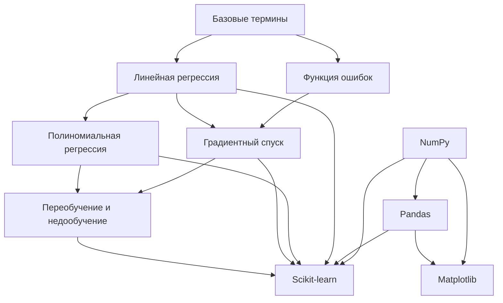

# 🧭 Machine Learning - Навигация

> **Центральный файл навигации по всем материалам машинного обучения**

## 📚 Основные концепции

### 🎯 Базовые понятия
- [[Базовые термины]] - Признаки, метки, модели, веса и смещения
- [[Функция ошибок]] - Абсолютная и квадратичная погрешности

### 📈 Алгоритмы регрессии
- [[Линейная регрессия]] - Основы линейного моделирования
- [[Полиномиальная регрессия]] - Работа с нелинейными зависимостями
- [[Градиентный спуск]] - Оптимизация параметров модели

### ⚖️ Качество модели
- [[Переобучение и недообучение]] - Проблемы обучения и регуляризация

## 🛠 Инструменты и библиотеки

### 📊 Вычисления и анализ данных
- [[Библиотеки/NumPy]] - Основа научных вычислений
- [[Библиотеки/Pandas]] - Анализ и обработка данных

### 📈 Визуализация
- [[Библиотеки/Matplotlib]] - Построение графиков и диаграмм

### 🤖 Машинное обучение
- [[Библиотеки/Scikit-learn]] - Готовые алгоритмы ML

## 🔄 Связи между темами

## 📝 Порядок изучения

### Для начинающих:
1. [[Базовые термины]] - Изучите основную терминологию
2. [[Функция ошибок]] - Поймите, как измеряется качество
3. [[Линейная регрессия]] - Первая модель машинного обучения
4. [[Градиентный спуск]] - Как оптимизировать модель
5. [[Переобучение и недообучение]] - Проблемы и их решения

### Для продвинутых:
6. [[Полиномиальная регрессия]] - Более сложные модели
7. [[Библиотеки/NumPy]] - Инструменты для вычислений
8. [[Библиотеки/Pandas]] - Работа с данными
9. [[Библиотеки/Matplotlib]] - Визуализация результатов
10. [[Библиотеки/Scikit-learn]] - Практическое применение

## 🏷️ Теги для поиска

- `#ml` - Все заметки по машинному обучению
- `#ml/basics` - Основные концепции
- `#ml/regression` - Алгоритмы регрессии
- `#ml/optimization` - Оптимизация и улучшение моделей
- `#ml/tools` - Инструменты и библиотеки
- `#ml/theory` - Теоретические основы
- `#ml/practice` - Практические примеры

---
*Этот файл служит центральной точкой навигации по всем материалам ML и автоматически обновляется при добавлении новых заметок.*

#ml #navigation